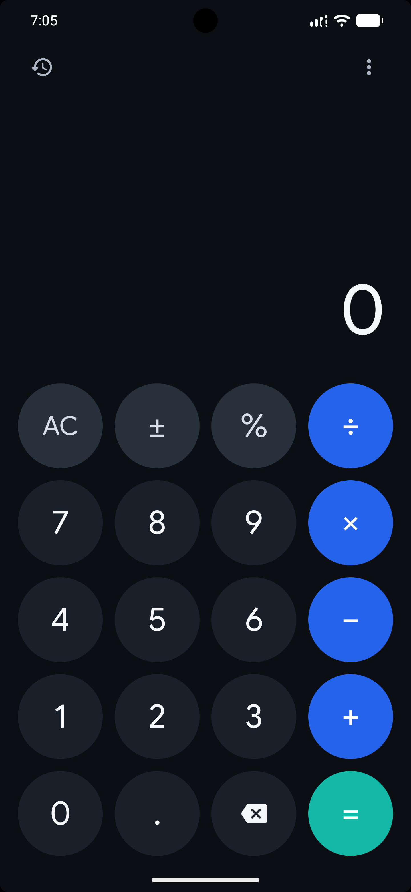
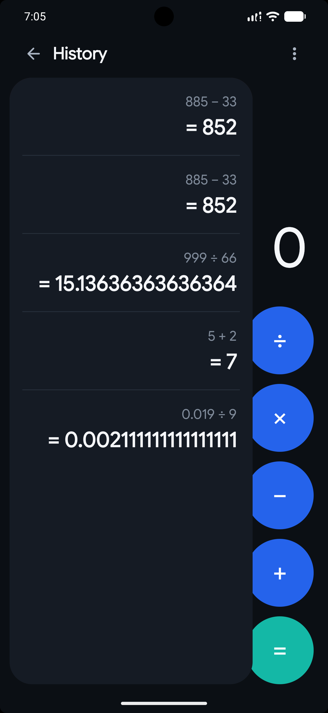
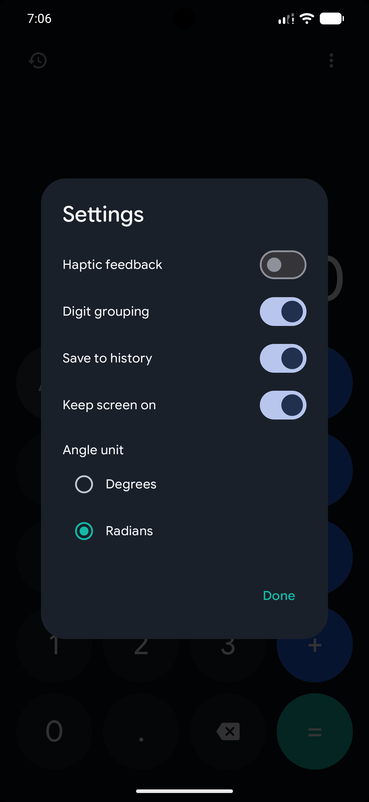
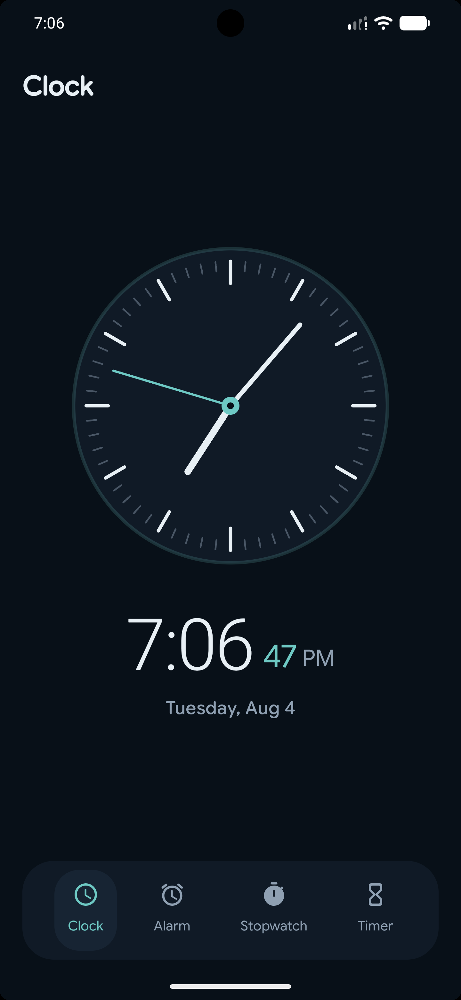
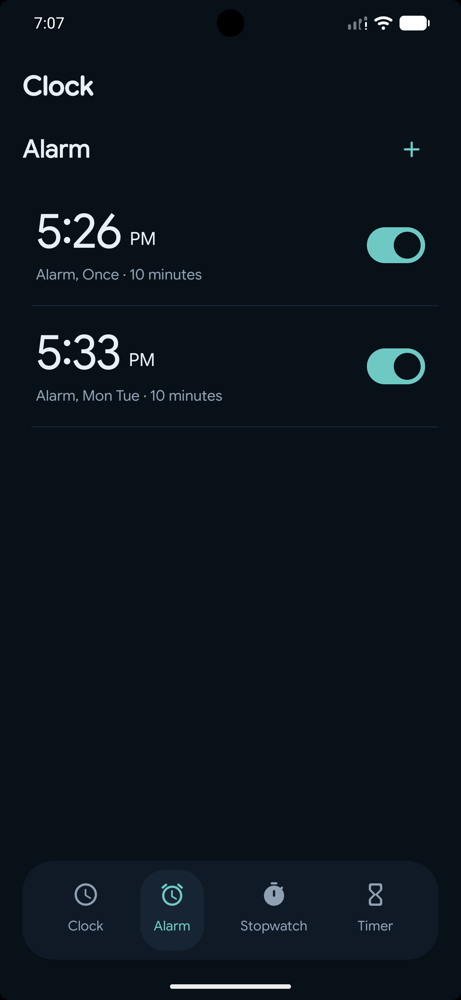
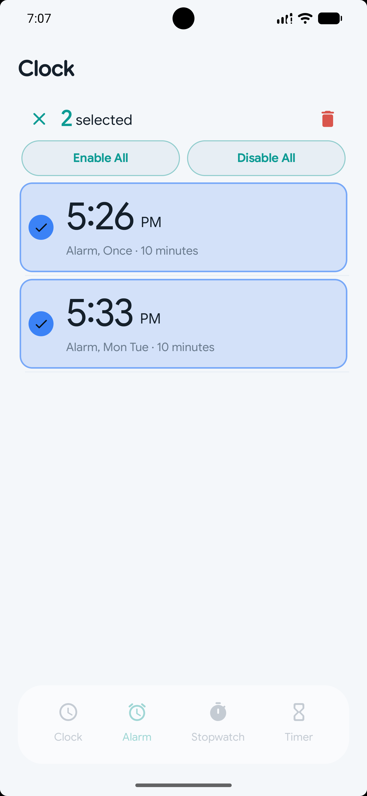

# Launcher3 by Aman

A customized Android launcher built on top of Google's Launcher3 project. This project focuses on improving the launcher experience while rebuilding and extending several system applications with modern Android development practices.

<p align="center">
  
  
  
</p>

<p align="center">
  
  
  
</p>

---

## About

Launcher3 by Aman is a customized version of Google's Launcher3 project. The objective of this project is to improve the overall launcher experience while redesigning and extending built-in applications with better UI, usability, and functionality.

During development, I focused on improving existing components as well as building new applications from the ground up. This project also helped me gain practical experience working with a large Android codebase, modern architecture patterns, and maintainable application design.

---

## Features

### Launcher

- Improved App Drawer layout and spacing
- Enhanced responsiveness across different screen sizes
- Cleaner interface and better usability
- Layout and UI optimizations

### Calculator

- Modernized user interface
- Improved color palette
- History drawer
- Scientific mode
- Settings screen
- Back stack support
- Improved navigation and overall user experience

### Clock

- Developed the initial Clock application
- Multi-selection support for alarms
- Bulk actions
  - Delete
  - Enable All
  - Disable All
- Full-screen alarm ringing interface
- Snooze and Dismiss actions
- Configurable snooze duration
- Default snooze duration of 10 minutes

### Notebook

- Developed the initial Notebook application
- Basic note management
- Designed with future enhancements in mind

---

## Tech Stack

- Kotlin
- Android SDK
- Android Studio
- Launcher3 (AOSP)
- MVVM Architecture
- Material Design
- AndroidX
- RecyclerView
- View Binding
- AlarmManager
- Git
- GitHub

---

## What I Learned

Working on this project strengthened my understanding of:

- Large-scale Android codebases
- Launcher3 architecture
- MVVM Architecture
- Android application lifecycle
- State management
- Responsive Android UI design
- RecyclerView and Selection APIs
- Alarm scheduling and lifecycle management
- Navigation and back stack handling
- Modular project structure
- Writing clean, maintainable, and scalable Android code
- Version control using Git and GitHub

---

## Project Structure

```text
Launcher3
├── launcher/
├── calculator/
├── clock/
├── notebook/
└── shared/
```

---

## Future Improvements

- Additional launcher customization
- More Notebook features
- More Calculator enhancements
- Widget improvements
- Performance optimization
- UI refinements

---

## Developer

### Aman Sharma

Android Developer passionate about building modern Android applications using Kotlin and Android Jetpack. I enjoy improving user experience, writing clean and maintainable code, and continuously learning Android internals by working on real-world projects.

**GitHub**

https://github.com/engineer-aman-sharma

**LinkedIn**

https://www.linkedin.com/in/engineer-aman-sharma

---

## Acknowledgements

This project is based on Google's open-source Launcher3 project. Credit goes to the Android Open Source Project (AOSP) and all Launcher3 contributors for providing the foundation on which this project is built.